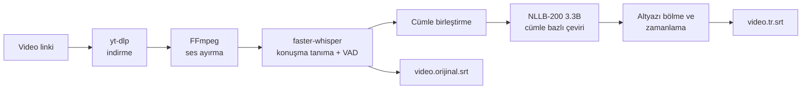

# Altyazıcı

**Video linkinden Türkçe altyazı.** Facebook, YouTube, Instagram, TikTok, X ve yt-dlp'nin desteklediği yüzlerce siteden bir video linki yapıştırın; Altyazıcı videoyu indirir, konuşmayı yazıya döker, Türkçeye çevirir ve `.srt` altyazı dosyası üretir.

Konuşma tanıma ve çeviri **bilgisayarınızda yerel olarak** çalışır. Hesap, API anahtarı ya da abonelik gerekmez; video içeriği üçüncü taraf bir çeviri servisine gönderilmez.

[](../../releases/latest)


---

## İçindekiler

- [Özellikler](#özellikler)
- [Nasıl çalışır](#nasıl-çalışır)
- [Kurulum](#kurulum)
- [Kullanım](#kullanım)
- [Çıktılar](#çıktılar)
- [Desteklenen diller ve siteler](#desteklenen-diller-ve-siteler)
- [Sistem gereksinimleri](#sistem-gereksinimleri)
- [Çeviri kalitesi ve sınırlamalar](#çeviri-kalitesi-ve-sınırlamalar)
- [Güncelleme](#güncelleme)
- [Kaldırma](#kaldırma)
- [Sorun giderme](#sorun-giderme)
- [Sorun bildirme (günlük ve rapor)](#sorun-bildirme-günlük-ve-rapor)
- [Proje yapısı](#proje-yapısı)
- [Kullanılan teknolojiler ve lisanslar](#kullanılan-teknolojiler-ve-lisanslar)
- [Yasal uyarı](#yasal-uyarı)

## Özellikler

- **Tek adım:** Link yapıştır, **Çevir**'e bas. İndirme, ses ayırma, konuşma tanıma ve çeviri otomatik yapılır.
- **Yerel ve ücretsiz:** Whisper (konuşma tanıma) ve NLLB (çeviri) modelleri bilgisayarınızda çalışır. İlk kurulumdan sonra internet gerekmez (video indirmek hariç).
- **Çok site desteği:** yt-dlp sayesinde Facebook Reels ve videoları, YouTube, Instagram, TikTok, X ve çok daha fazlası.
- **Standart çıktı:** Her videonun yanında orijinal metin ve Türkçe `.srt` dosyası. VLC gibi oynatıcılarda otomatik yüklenir.
- **Ekran kartı desteği:** NVIDIA ekran kartı otomatik algılanır ve kullanılır; yoksa işlemciyle çalışır.
- **Çeviri motoru seçimi:** Varsayılan yerel NLLB; isteğe bağlı Google Translate (internet gerekir, hız sınırına takılabilir; takılırsa otomatik NLLB'ye geçer).
- **Otomatik bakım:** İndirici (yt-dlp) her açılışta güncellenir; diğer kütüphaneler `uv.lock` ile sabittir. `Guncelle.bat` ile program kodu da güncellenir.
- **Günlük ve sorun raporu:** Her adım ve hata kaydedilir; tek tuşla geliştiriciye gönderilebilecek bir rapor üretilir.
- **Temiz kaldırma:** `Kaldir.bat` kurulan her şeyi adım adım onay isteyerek temizler.
- **Sistem Python'una dokunmaz:** Kendi izole Python 3.12 ortamını kullanır; bilgisayarınızda başka bir Python olsa bile etkilenmez.

## Nasıl çalışır



1. **İndirme:** yt-dlp videoyu `.mp4` olarak indirir. Oynatma listesi ve kanal linkleri bilerek desteklenmez; yalnızca tek video işlenir.
2. **Ses ayırma:** FFmpeg sesi 16 kHz tek kanallı biçime çevirir.
3. **Konuşma tanıma:** faster-whisper, konuşma bulunmayan bölümleri (müzik, sessizlik) ses etkinliği algılama (VAD) ile eler. Böylece boş bölümlere uydurma metin yazılması engellenir.
4. **Çeviri:** Kısa parçalar cümle bazında birleştirilir, NLLB her cümleyi ayrı çevirir. NLLB'nin çok cümleli girdide içerik atma eğilimine karşı, çıktı kaynağa göre çok kısa kalan cümleler ikiye bölünüp yeniden çevrilir.
5. **Altyazı üretimi:** Çevrilen metin en fazla iki satırlık parçalara bölünür ve süre bu parçalara paylaştırılır.

Ekran kartı belleği yeterliyse (≥ 3,5 GB) Whisper `large-v3`, değilse `medium` modeli kullanılır.

## Kurulum

1. [Releases](../../releases/latest) sayfasından **`Altyazici.zip`** dosyasını indirin ve bir klasöre çıkarın.
2. **`Kurulum.bat`** dosyasını çalıştırın. İlk kurulum şunları otomatik yapar:
   - [uv](https://docs.astral.sh/uv/) paket yöneticisini kurar (yoksa),
   - izole Python 3.12 ortamını ve kütüphaneleri kurar,
   - FFmpeg'i indirir,
   - Whisper ve NLLB modellerini indirir (**toplam yaklaşık 7 GB**, bir kez).
3. **`Baslat.bat`** ile programı açın.

> Kurulum sırasında internet bağlantısı ve yaklaşık 10 GB boş disk alanı gerekir.

## Kullanım

1. `Baslat.bat` dosyasına çift tıklayın.
2. Video linkini kutuya yapıştırın.
3. Konuşma dilini seçin (varsayılan Endonezce; emin değilseniz *Otomatik algıla*).
4. **Çevir**'e basın. İlerleme çubuğu dört adımı gösterir: indirme → ses → konuşma tanıma → çeviri.
5. İş bitince sonuç klasörü kendiliğinden açılır.

**Giriş isteyen videolar:** Bazı siteler (ör. yaş kısıtlı YouTube videoları) giriş ister. Arayüzdeki *Tarayıcı çerezlerini kullan* seçeneğini işaretleyip o siteye giriş yaptığınız tarayıcıyı seçin.

Dil, çeviri motoru ve tarayıcı seçimleriniz `ayarlar.json` dosyasında saklanır.

## Çıktılar

```
Ciktilar\
└── 2026-10-05_<video-basligi>\
    ├── video.mp4             ← indirilen video
    ├── video.orijinal.srt    ← konuşmanın orijinal dildeki metni
    └── video.tr.srt          ← Türkçe altyazı
```

Altyazıyı görmek için `video.mp4` dosyasını VLC ile açın; aynı adlı `.srt` dosyaları otomatik yüklenir. Yüklenmezse *Altyazı → Altyazı Dosyası Ekle* ile `video.tr.srt` dosyasını seçin.

## Desteklenen diller ve siteler

| | |
|---|---|
| **Konuşma dili (arayüzde)** | Endonezce (varsayılan), Hintçe, İngilizce, Malayca, otomatik algılama |
| **Hedef dil** | Türkçe |
| **Siteler** | [yt-dlp'nin desteklediği siteler](https://github.com/yt-dlp/yt-dlp/blob/master/supportedsites.md) (Facebook, YouTube, Instagram, TikTok, X, …) |

Çeviri çekirdeği Endonezce, Hintçe, İngilizce, Malayca dışında birçok dili de tanır; bunlar arayüzde henüz listelenmemiştir.

## Sistem gereksinimleri

| | Gereksinim |
|---|---|
| İşletim sistemi | Windows 10 / 11 (64 bit) |
| Disk | Yaklaşık 10 GB boş alan (modeller ~7 GB) |
| Bellek | En az 8 GB RAM önerilir |
| Ekran kartı | İsteğe bağlı; NVIDIA GPU işlemi belirgin biçimde hızlandırır |
| İnternet | Kurulum ve video indirme için |

Geliştirme ortamında **NVIDIA GTX 1650 Ti (4 GB)** ekran kartıyla Whisper `large-v3` (int8) ve NLLB 3.3B modelleri sorunsuz çalıştırılmıştır. Ekran kartı yoksa program işlemciye geçer; bu mod çok daha yavaştır ve daha küçük bir Whisper modeli kullanır.

## Çeviri kalitesi ve sınırlamalar

Altyazıcı yerel ve ücretsiz modeller kullandığı için çıktı insan çevirisi kalitesinde değildir. Sonuçları kullanmadan önce kontrol edin.

- **Günlük konuşma ve argo:** NLLB resmî dilde güçlü, gündelik konuşma ve argoda zayıftır; bazı cümleler eksik ya da anlamsız çevrilebilir.
- **Konuşma tanıma hataları:** Whisper arka plan gürültüsü, müzik ve hızlı konuşmada sözcükleri yanlış duyabilir. Bu hata çeviriye aynen yansır. Kontrol için `video.orijinal.srt` dosyasına bakın.
- **Karışık dil (ör. Endonezce–İngilizce):** Doğruluk düşer.
- **Müzik ağırlıklı videolar:** Konuşma bulunamazsa program "Videoda konuşma bulunamadı" hatası verir.
- **Google Translate seçeneği:** Resmî olmayan ücretsiz uç nokta kullanır; art arda isteklerde engellenebilir ve garanti verilmez.

## Güncelleme

| Yöntem | Nasıl |
|---|---|
| **Otomatik** | `Guncelle.bat` en son sürümü GitHub'dan indirir; kodu ve `uv.lock` dosyasını günceller, kütüphaneleri eşitler, yt-dlp'yi yeniler. |
| **Elle** | Yeni `Altyazici.zip` dosyasını indirip klasörün üzerine çıkarın, ardından `Guncelle.bat` çalıştırın. |

Güncelleme **videolarınıza (`Ciktilar`), modellere, FFmpeg'e, günlüklere ve ayarlarınıza dokunmaz.** `Baslat.bat` ayrıca her açılışta yalnızca yt-dlp'yi günceller (internet yoksa atlar).

## Kaldırma

`Kaldir.bat` her adımda onay isteyerek şunları temizler:

1. Kurulu bileşenler: `.venv`, `modeller` (~7 GB), `araclar`, `loglar`, ayarlar
2. `Ciktilar` (videolarınız; **ayrı sorulur**, önerilen cevap *Hayır*)
3. uv ve Python 3.12 (yalnızca `Kurulum.bat` kendisi kurduysa)
4. Program klasörünün kendisi

Sistemdeki mevcut Python kurulumunuza dokunulmaz.

## Sorun giderme

| Belirti | Çözüm |
|---|---|
| İndirme hatası | `Guncelle.bat` çalıştırın (yt-dlp güncellenir); olmazsa *Tarayıcı çerezlerini kullan* seçeneğini deneyin. |
| "Oynatma listesi desteklenmiyor" | Tek bir videonun linkini girin. |
| "Videoda konuşma bulunamadı" | Video müzik/sessizlik ağırlıklıdır ya da dil seçimi yanlıştır; *Otomatik algıla*yı deneyin. |
| Ekran kartı belleği yetersiz | Çeviri sırasında oyun, video düzenleme gibi ağır programları kapatın. |
| Google çevirisi çalışmıyor | Hız sınırı olabilir; program otomatik yerel NLLB'ye geçer ya da motoru elle NLLB yapın. |
| Başka bir sorun | **Sorun Raporu Oluştur** düğmesiyle rapor hazırlayıp geliştiriciye gönderin ([ayrıntılar](#sorun-bildirme-günlük-ve-rapor)). |
| Kurulum yarıda kesildi | `Kurulum.bat` dosyasını tekrar çalıştırın; indirilen dosyalar çoğunlukla korunur ve kaldığı yerden devam eder. |

## Sorun bildirme (günlük ve rapor)

Program her çalıştığında ne yaptığını **günlük dosyasına** yazar. Bir sorun yaşarsanız geliştiriciye göndereceğiniz tek şey bir rapor dosyasıdır.

**Rapor nasıl oluşturulur**

1. Programın altındaki **Sorun Raporu Oluştur** düğmesine basın.
2. Masaüstünde `Altyazici-rapor-<tarih>.zip` dosyası oluşur ve Dosya Gezgini'nde seçili açılır.
3. Bu dosyayı geliştiriciye gönderin.

**Raporun içi**

| Dosya | İçeriği |
|---|---|
| `sistem_bilgisi.txt` | Windows ve Python sürümü, ekran kartı ve sürücü, RAM, boş disk, kütüphane sürümleri, FFmpeg, model boyutları, ayarlar |
| `loglar/altyazici.log` | Program günlüğü: her adım, süreler, tam hata izi, yt-dlp ve Whisper mesajları |
| `loglar/kurulum.log`, `guncelle.log`, `baslat.log` | `Kurulum.bat`, `Guncelle.bat` ve `Baslat.bat` çıktıları (varsa) |

**Gizlilik:** Rapor **video dosyalarını içermez.** Ancak indirdiğiniz video **linklerini ve başlıklarını** içerebilir; göndermeden önce bunu göz önünde bulundurun. Windows kullanıcı adınız (`C:\Users\<ad>`) rapordan otomatik olarak `%USERPROFILE%` ile değiştirilir. Program çerez içeriklerini ve parolaları günlüğe yazmaz (yalnızca seçtiğiniz tarayıcının adı kaydedilir).

**Günlükleri elle bulmak:** **Günlüğü Aç** düğmesi `loglar\altyazici.log` dosyasını açar. Kurulum sırasında program açılamıyorsa `loglar` klasörünü doğrudan program klasöründe bulabilirsiniz. Günlük dosyası 1 MB'ta döner (en fazla 4 dosya), yani disk alanını doldurmaz.

## Proje yapısı

```
altyazici/
├── Kurulum.bat        ilk kurulum
├── Baslat.bat         programı açar (yt-dlp'yi günceller)
├── Guncelle.bat       kod + kütüphane güncelleme
├── Kaldir.bat         kaldırma
├── loglar/            günlükler (otomatik oluşur)
├── KULLANIM.txt       kısa kullanım kılavuzu
├── pyproject.toml     bağımlılıklar
├── uv.lock            sabitlenmiş sürümler
├── surum.txt          sürüm numarası
├── paketle.py         yayın paketi üretir (geliştirici)
└── app/
    ├── gui.py             Tkinter arayüzü
    ├── cevir_core.py      indirme, konuşma tanıma, çeviri, SRT
    ├── gunluk.py          günlük ve sorun raporu
    ├── kayitli.ps1        kurulum/güncelleme çıktısını log'a da yazar
    ├── guncelle.py        GitHub'dan güncelleme
    └── modelleri_indir.py kurulumda model indirme
```

Geliştiriciler için yayın adımları [`YAYIN.md`](YAYIN.md) dosyasındadır.

## Kullanılan teknolojiler ve lisanslar

| Bileşen | Görevi | Lisans |
|---|---|---|
| [yt-dlp](https://github.com/yt-dlp/yt-dlp) | Video indirme | Unlicense |
| [FFmpeg](https://ffmpeg.org/) | Ses ayırma | LGPL/GPL (kullanılan derleme: GPL) |
| [faster-whisper](https://github.com/SYSTRAN/faster-whisper) / [Whisper](https://github.com/openai/whisper) | Konuşma tanıma | MIT |
| [CTranslate2](https://github.com/OpenNMT/CTranslate2) | Model çalıştırma | MIT |
| [NLLB-200](https://github.com/facebookresearch/fairseq/tree/nllb) (Meta) | Çeviri | **CC-BY-NC 4.0 (ticari olmayan kullanım)** |
| [uv](https://github.com/astral-sh/uv) | Paket ve Python yönetimi | MIT / Apache-2.0 |

> **Önemli:** NLLB modeli yalnızca **ticari olmayan** kullanıma izin verir. Altyazıcı kişisel ve ticari olmayan kullanım için tasarlanmıştır.

## Yasal uyarı

Bu program yalnızca **kişisel kullanım** içindir. İndirdiğiniz içerikleri yeniden yayınlamayın veya paylaşmayın; telif haklarına ve ilgili sitenin kullanım şartlarına uyun. Videoları indirme ve işleme sorumluluğu kullanıcıya aittir.
